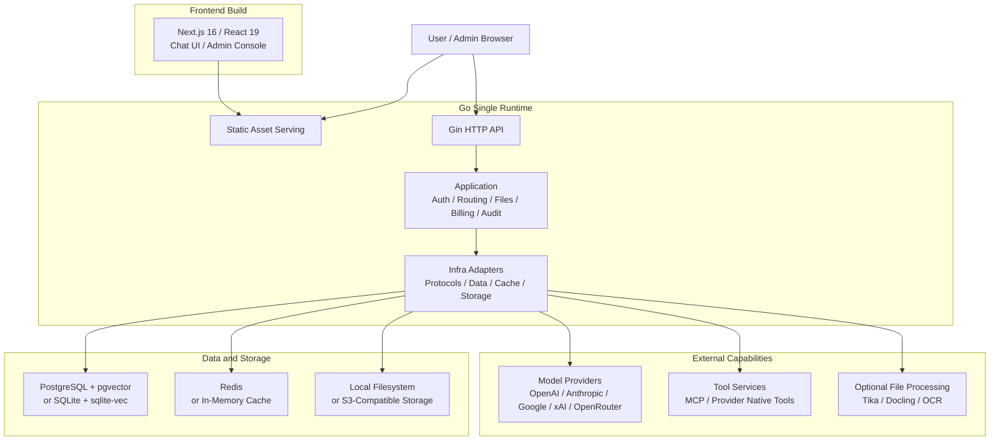

<p align="center">
  <picture>
    <source media="(prefers-color-scheme: dark)" srcset="./frontend/public/logo-white.svg" />
    
  </picture>
</p>

<p align="center">
  An integrated AI platform for enterprise model routing, chat, files, tools, billing, identity, and operations.
</p>

<p align="center">
  English | <a href="./README.zh-CN.md">简体中文</a>
</p>

<p align="center">
  <a href="https://deeix.com"></a>
  <a href="https://deeix.com/docs/deeix-chat/quickstart"></a>
  <a href="https://t.me/deeix_chat"></a>
  <a href="https://x.com/DEEIX_AI"></a>
  <a href="https://www.apache.org/licenses/LICENSE-2.0"></a>
  
  
  
</p>

## Overview

DEEIX Chat is an open-source, deployable AI platform for individuals, teams, and enterprises that need long-term, stable, and unified access to multiple model providers. It provides one clear entry point for multiple upstream models and providers, integrating multimodal chat, model routing, files and RAG, MCP tools, usage billing, identity, audit logs, and operational controls into one product.

The system is designed around simple deployment, efficient static delivery, and a low runtime resource footprint: lightweight without feeling limited, restrained without losing capability, and open without becoming disorderly.


## Features

| Area | Capabilities |
| --- | --- |
| Conversations | A multimodal chat interface for daily use, with streaming, branches, retries, edits, feedback, sharing, rich rendering, and traceable model execution metadata. |
| Models and routing | A platform-model layer for upstream channels, real models, route bindings, priority, weights, circuit breaking, vendor mapping, and capability configuration, reducing the cost of multi-provider operations. |
| Protocols and adaptation | Unified support for OpenAI, Anthropic, Google/Gemini, xAI, OpenRouter, and OpenAI-compatible protocols across text, image, tools, and provider-native capability differences. |
| Files and retrieval | File upload, preview, extraction, OCR, storage quota, full-context injection, chunking, embeddings, and semantic retrieval so file content can naturally enter the conversation context. |
| Tool ecosystem | MCP servers and provider-native official tools with discovery, enablement, user selection, execution limits, result rendering, and tool-call traceability. |
| Context and memory | Message windows, token budgets, summary compression, conversation memory, long-term memory, and RAG evidence records for controlled-cost continuity. |
| Billing and payments | Model pricing, per-call tool pricing, subscriptions, top-ups, balances, usage ledgers, billing snapshots, Stripe Checkout, EPay, and webhook validation. |
| Identity and security | Local accounts, session management, HttpOnly refresh cookies, 2FA/TOTP, trusted devices, SSO/OIDC/OAuth, contact verification, and encrypted sensitive data. |
| Administration and audit | Centralized management for users, roles, upstreams, models, routes, pricing, subscriptions, balances, usage logs, audit logs, auth events, and system events. |
| Deployment and operations | Single-runtime frontend/API serving, Docker deployment, SQLite or PostgreSQL, in-memory cache or Redis, S3-compatible storage, Swagger, structured logs, version endpoint, GeoIP, and OpenTelemetry. |

<p align="center">
  
  
</p>

<p align="center">
  
  
  
</p>

## Architecture and Tech Stack

DEEIX Chat uses a split frontend/backend development model with a single-runtime deployment path. The frontend is built into static assets and served by the Go service, while APIs, authorization, model routing, files, billing, and audit capabilities run in the same backend runtime. Heavy document extraction and OCR capabilities are optional services, keeping the base deployment lightweight.



| Layer | Responsibility | Technologies |
| --- | --- | --- |
| Frontend | Chat UI, admin console, and static builds | Next.js 16, React 19, TypeScript, Tailwind CSS, Shadcn/UI, Streamdown, KaTeX, Mermaid, Recharts, Motion |
| Backend runtime | APIs, authentication, authorization, orchestration, protocol adaptation, and static serving | Go 1.26, Gin, Gorm, Swagger, OpenTelemetry, Zap |
| Data and cache | Domain data, vector retrieval, session state, and runtime cache | PostgreSQL, pgvector, SQLite, sqlite-vec, Redis, in-memory cache |
| Files and storage | Uploaded files, generated files, object storage, and local persistence | Local filesystem, S3-compatible object storage |
| File processing | Text extraction, OCR, document parsing, and LLM OCR fallback | Built-in extractors, Apache Tika, Docling, RapidOCR, Tesseract OCR, Paddle OCR, cloud OCR adapters, MinerU |
| Tool protocol | MCP tool integration and provider-native official tools | MCP Streamable HTTP JSON-RPC, provider-native tools |
| Deployment runtime | Lightweight single-node deployment or multi-node production deployment | Docker, Docker Compose, SQLite/in-memory cache, PostgreSQL/Redis |

The backend keeps clear internal boundaries: `cmd/internal/cli` handles entrypoints, `internal/app` assembles the application, `transport/http` owns the HTTP boundary, `application` coordinates use cases and transactions, `domain` expresses business semantics, and `infra` contains database, cache, storage, and external protocol implementations. The data layer uses domain-prefixed tables, while financial records, audit trails, system events, and high-growth vector data remain separate sources of truth.

## Quick Start

> Quick installation guide: [Quick Start](https://deeix.com/docs/deeix-chat/quickstart).

### Local Development

Local development is intended for editing source code and running the frontend and backend separately. The default config connects to local PostgreSQL and Redis. If you only want a low-dependency trial, use the lightweight Docker installation below.

1. Prepare backend configuration:

```bash
cp config.example.yaml config.yaml
```

Adjust `database.postgres.dsn`, `database.redis.*`, and public URLs in `config.yaml` for your local environment.

2. Start the backend:

```bash
cd backend
make run
```

3. Start the frontend:

```bash
cd frontend
pnpm install
cp .env.example .env.local
pnpm dev
```

The frontend uses `NEXT_PUBLIC_API_BASE_URL` for API requests. For local development, confirm that `frontend/.env.local` contains:

```env
NEXT_PUBLIC_API_BASE_URL=http://127.0.0.1:8080
```

URLs:

| Service | URL |
| --- | --- |
| Frontend | `http://localhost:3000` |
| API | `http://localhost:8080` |
| Swagger | `http://localhost:8080/swagger/index.html` |

If `NEXT_PUBLIC_API_BASE_URL` is omitted, local development defaults to `localhost:8080`; same-origin deployments use the current origin.

### Docker Deployment

Choose one installation profile first, then copy the matching config file. All root compose profiles expose the app at `http://localhost:8080` by default and mount the repository-level `config.yaml` to `/app/config.yaml` inside the container.

| Profile | Use case | Config file | Compose file | Built-in dependencies |
| --- | --- | --- | --- | --- |
| Lightweight | Local evaluation, personal use, small single-node deployments | `config.sqlite.example.yaml` | `docker-compose.sqlite.yml` | App only, SQLite + sqlite-vec + in-memory cache |
| Default | External PostgreSQL and Redis already exist | `config.example.yaml` | `docker-compose.yml` | App only |
| Full | Single-machine stack with app, PostgreSQL, and Redis | `config.full.example.yaml` | `docker-compose.full.yml` | App, PostgreSQL, Redis |

#### 1. Lightweight Installation: SQLite

This is the lowest-dependency deployment. It starts only the `app` container, stores data and local vector indexes in SQLite, and uses the in-process memory cache. Use it for local evaluation, personal deployments, and small single-node setups.

```bash
cp config.sqlite.example.yaml config.yaml
docker compose -f docker-compose.sqlite.yml up -d
```

SQLite + memory cache is single-process only. It is good for local use, evaluation, and small single-node deployments. Use PostgreSQL + Redis for multi-node or high-concurrency production deployments.

#### 2. Default Installation: External PostgreSQL + Redis

Use this when PostgreSQL and Redis are already managed outside this compose stack. Before starting, set database and Redis addresses to values reachable from inside the container; if the services run on the Docker host, `host.docker.internal` is usually the right hostname.

```bash
cp config.example.yaml config.yaml
# Edit database.postgres.dsn, database.redis.*, and public URLs.
docker compose up -d
```

The default `docker-compose.yml` starts only the application container. Keep compose `environment` empty unless you intentionally want environment variables to override `config.yaml`.

#### 3. Full Installation: PostgreSQL + Redis Containers

Use this when you want compose to start the app, PostgreSQL, and Redis together.

```bash
cp config.full.example.yaml config.yaml
docker compose -f docker-compose.full.yml up -d
```

`docker-compose.full.yml` sets `POSTGRES_DSN`, `REDIS_ADDR`, `REDIS_USERNAME`, and `REDIS_PASSWORD` in compose `environment`, so those values override the database and Redis values in `config.yaml`.

#### Configuration, Persistence, and Image

Configuration priority is `environment variables > config.yaml > built-in defaults`. `config.yaml` is for static infrastructure and security configuration such as server URLs, database, cache, storage, GeoIP, tracing, JWT, and encryption keys. Runtime business settings are stored in the database and managed in the admin console.

The default compose files persist application data:

| Data | Container path |
| --- | --- |
| SQLite database | `/app/data/deeix.db` |
| Uploaded and generated files | `/app/storage` |
| PostgreSQL data | `/var/lib/postgresql/data`, full installation only |
| Redis data | `/data`, full installation only |

The default application image is `ghcr.io/deeix-ai/deeix-chat:latest`. Override it with `DEEIX_CHAT_IMAGE` when testing a custom build:

```bash
DEEIX_CHAT_IMAGE=deeix-chat:local docker compose up -d --build
```

`APP_ENV` accepts `dev`/`development` and `prod`/`production`, normalizes them to `dev` or `prod`, and defaults to `prod` when omitted. Use `dev` only for local development. Public production deployments should keep `APP_ENV=prod` or `APP_ENV=production` and use production secrets.

#### Optional Installation Services

These services are optional. Start only the ones you enable in the admin console or `config.yaml`.
They attach to `deeix-chat-network`; start one root compose profile first, or create the network manually with `docker network create deeix-chat-network`.

```bash
docker compose -f docker/tika/docker-compose.yml up -d
docker compose -f docker/tesseract/docker-compose.yml up -d --build
docker compose -f docker/docling/docker-compose.yml up -d --build
```

Default local endpoints:

| Service | URL | Purpose |
| --- | --- | --- |
| Tika | `http://127.0.0.1:9998` | Document text extraction |
| Tesseract OCR | `http://127.0.0.1:8004/ocr` | OCR service |
| Docling | `http://127.0.0.1:8005/ocr` | Document/OCR extraction |

`docker/rapidocr` currently provides a Dockerfile and app entrypoint, but no compose file. Add a compose file or run it manually if you choose RapidOCR.

### Separated Deployment

Use this mode when the frontend and backend are served from different public origins, for example `https://chat.example.com` and `https://api.example.com`.

1. Configure public URLs.

   - Frontend build variable: `NEXT_PUBLIC_API_BASE_URL=https://api.example.com`
   - Backend config: `server.public_api_base_url=https://api.example.com`
   - Backend config: `server.public_web_base_url=https://chat.example.com`
   - Backend config: `server.cors_allow_origin=https://chat.example.com`

   For Docker image builds, pass the frontend API URL at build time:

   ```bash
   docker build --build-arg NEXT_PUBLIC_API_BASE_URL=https://api.example.com -t deeix-chat .
   ```

2. Build and publish the frontend.

   ```bash
   cd frontend
   pnpm install
   NEXT_PUBLIC_API_BASE_URL=https://api.example.com pnpm build
   ```

   The static output is `frontend/out`. Serve it with Nginx, CDN, object storage, or any static web server. To let the Go backend serve the frontend, place `frontend/out` under `server.frontend_dist_dir`; the Docker image defaults to `/app/frontend/out`.

3. Apply CDN rules.

   | Path | Rule |
   | --- | --- |
   | `/_next/static/*` | Cache for 1 year with immutable assets enabled. |
   | `/logo*.svg`, `/*.ico`, `/*.png`, `/*.jpg`, `/*.webp`, `/*.woff2` | Cache for 1 day to 30 days. |
   | `/`, `/*.html`, `/chat*`, `/recent*`, `/files*`, `/setting*`, `/admin*`, `/share*` | Do not long-cache. Use `no-cache` or a short TTL. |
   | `/api/*`, `/healthz`, `/readyz`, `/swagger/*` | Bypass CDN cache and forward all request headers, methods, query strings, and request bodies. |

   If the CDN serves `frontend/out` from object storage, enable route fallback so clean URLs resolve to their exported `index.html` files, for example `/chat` -> `/chat/index.html`.

### Startup Check and First Login

After the application starts, verify the health endpoint, config file, and startup logs. For Docker deployments:

```bash
curl http://localhost:8080/healthz
docker compose exec app ls -l /app/config.yaml
docker compose logs app
```

If the database does not contain a superadmin account, the backend creates the initial administrator on first startup and prints the initial password only once.

| Item | Description |
| --- | --- |
| Initial username | `admin` |
| Initial password | Inspect backend startup logs, search for `bootstrap superadmin created`, and read the `password` field. |
| First login | The system requires changing the username and password. |
| Later changes | Use the account flow or admin console; credentials are not managed through `config.yaml`. |

If a superadmin already exists, the service does not regenerate or print the initial password again.

## Configuration

> Full configuration guide: [Configuration](https://deeix.com/docs/deeix-chat/configuration).

Backend configuration is split into static runtime configuration and runtime business settings. Static runtime configuration describes the infrastructure, security, and storage parameters required to start the service, and is provided through `config.yaml` and environment variables. Runtime business settings cover product capabilities such as authentication, conversations, models, files, and billing; they are stored in `system_settings` and maintained from the admin console. Environment variables override matching config-file values, which is useful for containerized deployments, separated deployments, and secret injection.

At startup, the backend resolves the default config file from the working directory: starting from the repository root reads `config.yaml`, while starting from `backend/` reads `../config.yaml`. Docker deployments usually mount host `./config.yaml` as read-only `/app/config.yaml` inside the container. If the config file is stored elsewhere, set `CONFIG_FILE` to a path accessible from the running process or container.

Static configuration environment variables:

| Area | Environment variable | Purpose |
| --- | --- | --- |
| Frontend build | `NEXT_PUBLIC_API_BASE_URL` | Browser API base URL; set in `frontend/.env.local` for local dev or at build time for separated deployment. |
| Config file | `CONFIG_FILE` | Optional config file path; Docker values should use the container path. |
| Application | `APP_NAME` | Application name. |
| Application | `APP_ENV` | Runtime environment: `dev`/`development` or `prod`/`production`; omitted values default to `prod`. |
| HTTP service | `HTTP_PORT` | API/runtime port. |
| HTTP service | `CORS_ALLOW_ORIGIN` | Allowed CORS origins, comma-separated. |
| HTTP service | `TRUSTED_PROXIES` | Trusted proxy CIDR list. |
| HTTP service | `PUBLIC_API_BASE_URL` | Public API URL for links, callbacks, and public URL generation. |
| HTTP service | `PUBLIC_WEB_BASE_URL` | Public Web URL for links, callbacks, and public URL generation. |
| HTTP service | `FRONTEND_DIST_DIR` | Frontend static output directory. |
| HTTP service | `HTTP_READ_HEADER_TIMEOUT_SECONDS` | HTTP read-header timeout. |
| HTTP service | `HTTP_READ_TIMEOUT_SECONDS` | HTTP request read timeout. |
| HTTP service | `HTTP_IDLE_TIMEOUT_SECONDS` | HTTP keep-alive idle timeout. |
| HTTP service | `HTTP_MAX_HEADER_BYTES` | Maximum HTTP request header size. |
| Security | `JWT_SECRET` | JWT signing secret. |
| Security | `DATA_ENCRYPTION_KEY` | Key material for upstream API keys, SSO secrets, MCP tokens, sensitive settings, and TOTP secrets. |
| Security | `SSRF_PROTECTION_ENABLED` | Enables outbound SSRF protection. |
| Security | `TURNSTILE_SITEVERIFY_URL` | Cloudflare Turnstile siteverify endpoint. |
| Database | `DATABASE_DRIVER` | `postgres` or `sqlite`. |
| PostgreSQL | `POSTGRES_DSN` | PostgreSQL DSN. |
| PostgreSQL | `POSTGRES_MAX_OPEN_CONNS` | Maximum open connections. |
| PostgreSQL | `POSTGRES_MAX_IDLE_CONNS` | Maximum idle connections. |
| PostgreSQL | `POSTGRES_CONN_MAX_LIFETIME_MINUTES` | Maximum connection lifetime. |
| PostgreSQL | `POSTGRES_CONN_MAX_IDLE_TIME_MINUTES` | Maximum idle connection time. |
| SQLite | `SQLITE_PATH` | Database file path. |
| SQLite | `SQLITE_DSN` | Full DSN; takes priority over path-based DSN construction. |
| SQLite | `SQLITE_MAX_OPEN_CONNS` | Maximum open connections, default `1`. |
| SQLite | `SQLITE_BUSY_TIMEOUT_MS` | Busy timeout. |
| SQLite | `SQLITE_CACHE_SIZE_KB` | Page cache size. |
| SQLite | `SQLITE_MMAP_SIZE_BYTES` | Mmap size. |
| SQLite | `SQLITE_SYNCHRONOUS` | Synchronous mode: `OFF`, `NORMAL`, `FULL`, or `EXTRA`. |
| SQLite | `SQLITE_TEMP_STORE` | Temporary storage: `DEFAULT`, `FILE`, or `MEMORY`. |
| Cache | `CACHE_DRIVER` | `redis` or `memory`; `memory` is single-process only. |
| Redis | `REDIS_ADDR` | Redis address. |
| Redis | `REDIS_USERNAME` | Redis ACL username; leave empty for password-only/default-user Redis. |
| Redis | `REDIS_PASSWORD` | Redis password. |
| Redis | `REDIS_DB` | Redis DB number. |
| Redis | `REDIS_TLS_ENABLED` | Enable TLS for Redis connections, for example Upstash Redis. |
| Redis | `REDIS_TLS_INSECURE_SKIP_VERIFY` | Skip Redis TLS certificate verification; keep `false` unless required by a nonstandard endpoint. |
| Storage | `STORAGE_BACKEND` | `local` or `s3`. |
| Local storage | `STORAGE_ROOT_DIR` | Local file storage directory. |
| S3 storage | `STORAGE_S3_ENDPOINT` | S3-compatible endpoint. |
| S3 storage | `STORAGE_S3_REGION` | S3 region; required when S3 storage is enabled. |
| S3 storage | `STORAGE_S3_BUCKET` | S3 bucket; required when S3 storage is enabled. |
| S3 storage | `STORAGE_S3_PREFIX` | S3 object prefix. |
| S3 storage | `STORAGE_S3_ACCESS_KEY_ID` | S3 Access Key ID. |
| S3 storage | `STORAGE_S3_SECRET_ACCESS_KEY` | S3 Secret Access Key. |
| S3 storage | `STORAGE_S3_FORCE_PATH_STYLE` | Whether to use path-style access. |
| GeoIP | `GEOIP_PROVIDER` | `none`, `ipwhois`, `ipinfo`, or `mmdb`. |
| GeoIP | `GEOIP_BASE_URL` | GeoIP HTTP service URL, default `https://ipwho.is`. |
| GeoIP | `GEOIP_TOKEN` | GeoIP service token. |
| GeoIP | `GEOIP_TIMEOUT_MS` | GeoIP request timeout. |
| GeoIP | `GEOIP_DATABASE_URL` | MMDB download URL. |
| GeoIP | `GEOIP_DATABASE_PATH` | Local MMDB path. |
| GeoIP | `GEOIP_DATABASE_MAX_BYTES` | Maximum MMDB download size. |
| GeoIP | `GEOIP_REFRESH_INTERVAL_HOURS` | MMDB refresh interval. |
| OpenTelemetry | `OTEL_ENABLED` | Enables tracing; when omitted, a configured endpoint enables tracing automatically. |
| OpenTelemetry | `OTEL_EXPORTER_OTLP_ENDPOINT` | OTLP collector endpoint. |
| OpenTelemetry | `OTEL_EXPORTER_OTLP_HEADERS` | OTLP headers in `key=value,key2=value2` format. |
| OpenTelemetry | `OTEL_EXPORTER_OTLP_INSECURE` | Whether to use plaintext transport. |
| OpenTelemetry | `OTEL_EXPORTER_OTLP_PROTOCOL` | OTLP exporter protocol: `grpc`, `http`, or `http/protobuf`; defaults to `grpc`. |
| OpenTelemetry | `OTEL_TRACES_SAMPLER_ARG` / `OTEL_SAMPLING_RATE` | Trace sampling rate from `0` to `1`; `OTEL_TRACES_SAMPLER_ARG` takes priority. |

Authentication, registration, conversation settings, model option policies, file processing, RAG, embedding, MCP, billing, payments, and announcements are runtime business settings, not static YAML configuration. Their defaults are seeded by the backend and maintained in the admin console.

## Feature Guides

- [User Guide](https://deeix.com/docs/deeix-chat/new-chat)
- [Admin Guide](https://deeix.com/docs/deeix-chat/admin-accounts)
- [Advanced Guide](https://deeix.com/docs/deeix-chat/advanced-capabilities-passthrough-tools)

## Security Notes

- User passwords are hashed with bcrypt.
- Production mode rejects unsafe default secrets, weak encryption keys, wildcard CORS, and non-HTTPS public URLs.
- Refresh tokens and recovery-style secrets are stored as hashes.
- Upstream API keys, SSO client secrets, MCP auth tokens, sensitive settings, and TOTP secrets are encrypted with AES-GCM using `DATA_ENCRYPTION_KEY`.
- Access tokens are short-lived and held client-side in memory; refresh tokens are issued through HttpOnly cookies.
- User-supplied model options are filtered before provider requests. System-generated fields such as model, messages, tools, system prompts, headers, and previous-response identifiers are not user-overridable.

## Documentation

- [Quick Start](https://deeix.com/docs/deeix-chat/quickstart)
- [Configuration](https://deeix.com/docs/deeix-chat/configuration)
- [User Guide](https://deeix.com/docs/deeix-chat/new-chat)
- [Admin Guide](https://deeix.com/docs/deeix-chat/admin-accounts)
- [Advanced Guide](https://deeix.com/docs/deeix-chat/advanced-capabilities-passthrough-tools)
- Backend guide: [backend/README.md](./backend/README.md)
- Backend standards: [backend/docs/README.md](./backend/docs/README.md)
- Frontend guide: [frontend/README.md](./frontend/README.md)
- Contributing: [CONTRIBUTING.md](./CONTRIBUTING.md)
- Security policy: [SECURITY.md](./SECURITY.md)
- Swagger UI: `http://localhost:8080/swagger/index.html`

## Acknowledgements

DEEIX Chat is built on the open-source ecosystem. Thanks to all maintainers and communities in the AI tooling ecosystem.

- [Next.js](https://nextjs.org)
- [Go](https://go.dev)
- [LINUX DO](https://linux.do)

## Contact & Community

- Website: [deeix.com](https://deeix.com/)
- Blog: [blog.cheny.me](https://blog.cheny.me/)
- Email: [support@deeix.com](mailto:support@deeix.com)
- Telegram: [t.me/deeix_chat](https://t.me/deeix_chat)
- X: [@DEEIX_AI](https://x.com/DEEIX_AI)

## License

DEEIX Chat is licensed under the [Apache License 2.0](./LICENSE).
