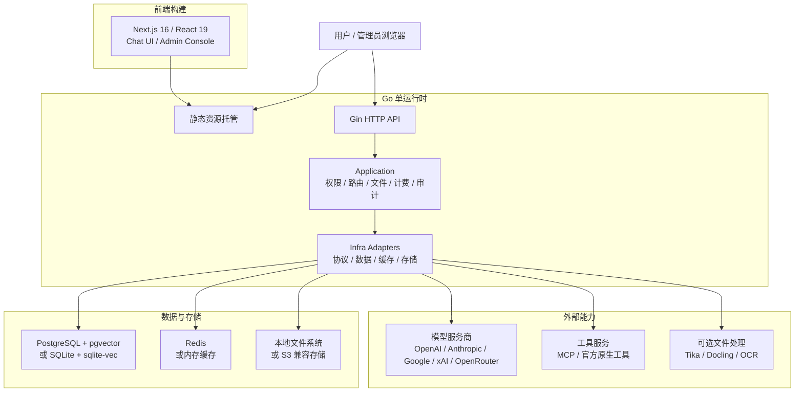

<p align="center">
  <picture>
    <source media="(prefers-color-scheme: dark)" srcset="./frontend/public/logo-white.svg" />
    
  </picture>
</p>

<p align="center">
  企业级模型路由、对话、文件、工具、计费、身份和运维的一体化 AI 平台。
</p>

<p align="center">
  <a href="./README.md">English</a> | 简体中文
</p>

<p align="center">
  <a href="https://deeix.com"></a>
  <a href="https://t.me/deeix_chat"></a>
  <a href="https://x.com/DEEIX_AI"></a>
  <a href="https://www.apache.org/licenses/LICENSE-2.0"></a>
  
  
  
</p>

## 项目简介

DEEIX Chat 是一款开源可部署的 AI 平台，面向需要长期、稳定、统一使用多模型能力的个人、团队与企业。它用一个清晰的使用入口承载多个上游模型和服务商，将多模态对话、模型路由、文件与 RAG、MCP 工具、用量计费、身份认证、审计日志和运维控制整合到同一个产品中。

系统围绕简单部署、高效静态分发和低资源的运行时占用设计，轻量而不简陋、克制而不缺能力、开放而不失秩序。


## 核心能力

| 模块 | 能力 |
| --- | --- |
| 对话体验 | 面向日常高频使用的多模态对话界面，支持流式响应、多分支、重试、编辑、反馈、分享、富文本渲染和可追踪的模型执行信息。 |
| 模型与路由 | 以平台模型为统一入口管理上游渠道、真实模型、路由绑定、优先级、权重、熔断、厂商映射和能力配置，降低多供应商接入后的维护成本。 |
| 协议与适配 | 统一适配 OpenAI、Anthropic、Google/Gemini、xAI、OpenRouter 和 OpenAI 兼容协议，覆盖文本、图片、工具和不同厂商的原生能力差异。 |
| 文件与检索 | 提供文件上传、预览、提取、OCR、存储配额、全文注入、分片、向量嵌入和语义检索能力，让文件内容自然进入对话上下文。 |
| 工具生态 | 同时支持 MCP Server 和厂商官方原生工具，覆盖工具发现、启停、用户选择、执行限制、结果渲染和调用链路追踪。 |
| 上下文与记忆 | 支持消息窗口、Token 预算、压缩摘要、会话记忆、长期记忆和 RAG 证据记录，在可控成本下维持连续对话体验。 |
| 计费与支付 | 内置模型定价、工具按次定价、订阅、充值、余额、用量账本、计费快照、Stripe Checkout、易支付和 Webhook 校验。 |
| 身份与安全 | 覆盖本地账号、会话管理、HttpOnly Refresh Cookie、2FA/TOTP、可信设备、SSO/OIDC/OAuth、联系方式验证和敏感信息加密。 |
| 管理与审计 | 后台集中管理用户、角色、上游、模型、路由、价格、订阅、余额、调用日志、审计日志、认证事件和系统事件。 |
| 部署与运维 | 支持单运行时托管前端与 API、Docker 部署、SQLite 或 PostgreSQL、内存缓存或 Redis、S3 兼容存储、Swagger、结构化日志、版本接口、GeoIP 和 OpenTelemetry。 |

<p align="center">
  
  
</p>

<p align="center">
  
  
  
</p>

## 系统架构与技术栈

DEEIX Chat 采用前后端分离开发、单运行时部署的结构。前端构建为静态资源后由 Go 服务统一托管，API、权限、模型路由、文件、计费和审计等后端能力由同一个运行时提供；文档提取、OCR 等重型能力以可选服务接入，避免基础部署过重。



| 层面 | 职责 | 主要技术 |
| --- | --- | --- |
| 前端 | 用户对话、后台管理、静态构建 | Next.js 16、React 19、TypeScript、Tailwind CSS、Shadcn/UI、Streamdown、KaTeX、Mermaid、Recharts、Motion |
| 后端运行时 | API、认证授权、业务编排、协议适配、静态资源托管 | Go 1.26、Gin、Gorm、Swagger、OpenTelemetry、Zap |
| 数据与缓存 | 领域数据、向量检索、会话状态、运行时缓存 | PostgreSQL、pgvector、SQLite、sqlite-vec、Redis、内存缓存 |
| 文件与存储 | 上传文件、生成文件、对象存储和本地持久化 | 本地文件系统、S3 兼容对象存储 |
| 文件处理 | 文本提取、OCR、文档解析和 LLM OCR 回退 | 内置提取、Apache Tika、Docling、RapidOCR、Tesseract OCR、Paddle OCR、云 OCR 适配、MinerU |
| 工具协议 | MCP 工具接入和厂商官方原生工具调用 | MCP Streamable HTTP JSON-RPC、Provider Native Tools |
| 部署运行 | 单节点轻量部署或多节点生产部署 | Docker、Docker Compose、SQLite/内存缓存、PostgreSQL/Redis |

后端内部保持清晰分层：`cmd/internal/cli` 负责启动入口，`internal/app` 负责应用装配，`transport/http` 负责 HTTP 边界，`application` 负责业务用例与事务编排，`domain` 表达领域语义，`infra` 承载数据库、缓存、存储和外部协议实现。数据层按领域前缀组织表结构，财务流水、审计日志、系统事件和高增长向量数据保持独立事实源。

## 快速开始

### 本地开发

本地开发适合改动源码并分别启动前后端。默认配置连接本机 PostgreSQL 和 Redis；如果只是低依赖试用，建议直接使用下面的 Docker 轻量安装。

1. 准备后端配置：

```bash
cp config.example.yaml config.yaml
```

根据本机环境调整 `config.yaml` 中的 `database.postgres.dsn`、`database.redis.*` 和公开访问地址。

2. 启动后端：

```bash
cd backend
make run
```

3. 启动前端：

```bash
cd frontend
pnpm install
cp .env.example .env.local
pnpm dev
```

前端请求后端使用 `NEXT_PUBLIC_API_BASE_URL`。本地开发时确认 `frontend/.env.local` 中包含：

```env
NEXT_PUBLIC_API_BASE_URL=http://127.0.0.1:8080
```

访问地址：

| 服务 | 地址 |
| --- | --- |
| 前端 | `http://localhost:3000` |
| API | `http://localhost:8080` |
| Swagger | `http://localhost:8080/swagger/index.html` |

不配置 `NEXT_PUBLIC_API_BASE_URL` 时，本地默认指向 `localhost:8080`；同源部署默认请求当前 origin。

### Docker 部署

Docker 部署先选择安装方案，再复制对应的配置文件。三套根目录 compose 文件都默认将应用暴露在 `http://localhost:8080`，并把仓库根目录的 `config.yaml` 挂载到容器内 `/app/config.yaml`。

| 方案 | 适合场景 | 配置文件 | Compose 文件 | 内置依赖 |
| --- | --- | --- | --- | --- |
| 轻量安装 | 本地试用、个人部署、小型单节点 | `config.sqlite.example.yaml` | `docker-compose.sqlite.yml` | 仅应用容器，SQLite + sqlite-vec + 内存缓存 |
| 默认安装 | 已有外部 PostgreSQL 和 Redis | `config.example.yaml` | `docker-compose.yml` | 仅应用容器 |
| 全量安装 | 单机同时部署应用、PostgreSQL 和 Redis | `config.full.example.yaml` | `docker-compose.full.yml` | 应用、PostgreSQL、Redis |

#### 1. 轻量安装：SQLite

依赖最少的部署方式，只启动 `app` 容器。数据和本地向量索引使用 SQLite，缓存使用进程内 memory，适合本地试用、个人部署和小型单节点场景。

```bash
cp config.sqlite.example.yaml config.yaml
docker compose -f docker-compose.sqlite.yml up -d
```

SQLite + memory cache 只适合单进程。多节点、高并发或更严格的生产部署建议使用 PostgreSQL + Redis。

#### 2. 默认安装：外部 PostgreSQL + Redis

适合已经有外部 PostgreSQL 和 Redis 的部署环境。启动前需要把数据库和 Redis 地址改成容器内可访问的地址；如果服务在 Docker 宿主机上，通常可以使用 `host.docker.internal`。

```bash
cp config.example.yaml config.yaml
# 修改 database.postgres.dsn、database.redis.* 和公开访问地址
docker compose up -d
```

默认 `docker-compose.yml` 只启动应用容器。除非明确需要覆盖 `config.yaml`，否则不要在 compose 里额外写同名 `environment`。

#### 3. 全量安装：PostgreSQL + Redis 容器

适合希望 compose 同时启动应用、PostgreSQL 和 Redis 的部署方式。

```bash
cp config.full.example.yaml config.yaml
docker compose -f docker-compose.full.yml up -d
```

`docker-compose.full.yml` 会在 compose `environment` 中设置 `POSTGRES_DSN`、`REDIS_ADDR`、`REDIS_USERNAME` 和 `REDIS_PASSWORD`，因此这些值会覆盖 `config.yaml` 里的数据库和 Redis 配置。

#### 配置、持久化和镜像

配置优先级是：`环境变量 > config.yaml > 代码内置默认值`。`config.yaml` 只负责静态基础设施和安全配置，例如服务地址、数据库、缓存、存储、GeoIP、Trace、JWT 和加密密钥。运行时业务配置存储在数据库中，并通过后台管理修改。

默认 compose 会持久化应用数据：

| 数据 | 容器路径 |
| --- | --- |
| SQLite 数据库 | `/app/data/deeix.db` |
| 上传文件和生成文件 | `/app/storage` |
| PostgreSQL 数据 | `/var/lib/postgresql/data`，仅全量安装 |
| Redis 数据 | `/data`，仅全量安装 |

默认应用镜像为 `ghcr.io/deeix-ai/deeix-chat:latest`。测试自定义构建时可通过 `DEEIX_CHAT_IMAGE` 覆盖：

```bash
DEEIX_CHAT_IMAGE=deeix-chat:local docker compose up -d --build
```

`APP_ENV` 支持 `dev`/`development` 和 `prod`/`production`，内部会规范化为 `dev` 或 `prod`；未配置时默认 `prod`。`dev` 只用于本地开发；公网生产部署应保持 `APP_ENV=prod` 或 `APP_ENV=production` 并使用生产密钥。

#### 可选安装服务

这些服务不是必须安装。只有在后台或 `config.yaml` 中启用对应文件处理能力时才需要启动。
这些 compose 文件会接入 `deeix-chat-network`；请先启动任一根目录 compose 方案，或手动执行 `docker network create deeix-chat-network`。

```bash
docker compose -f docker/tika/docker-compose.yml up -d
docker compose -f docker/tesseract/docker-compose.yml up -d --build
docker compose -f docker/docling/docker-compose.yml up -d --build
```

默认本地地址：

| 服务 | 地址 | 用途 |
| --- | --- | --- |
| Tika | `http://127.0.0.1:9998` | 文档文本提取 |
| Tesseract OCR | `http://127.0.0.1:8004/ocr` | OCR 服务 |
| Docling | `http://127.0.0.1:8005/ocr` | 文档/OCR 提取 |

`docker/rapidocr` 当前提供 Dockerfile 和服务入口，但还没有 compose 文件。如果选择 RapidOCR，需要自行补 compose 或手动运行。

### 分离部署

当前端和后端分别暴露在不同公网地址时使用分离部署，例如 `https://chat.example.com` 和 `https://api.example.com`。

1. 配置公开地址。

   - 前端构建变量：`NEXT_PUBLIC_API_BASE_URL=https://api.example.com`
   - 后端配置：`server.public_api_base_url=https://api.example.com`
   - 后端配置：`server.public_web_base_url=https://chat.example.com`
   - 后端配置：`server.cors_allow_origin=https://chat.example.com`

   Docker 镜像构建时需要传入前端 API 地址：

   ```bash
   docker build --build-arg NEXT_PUBLIC_API_BASE_URL=https://api.example.com -t deeix-chat .
   ```

2. 构建并发布前端。

   ```bash
   cd frontend
   pnpm install
   NEXT_PUBLIC_API_BASE_URL=https://api.example.com pnpm build
   ```

   静态产物在 `frontend/out`，可由 Nginx、CDN、对象存储或任意静态服务托管。如需由 Go 后端托管前端，把 `frontend/out` 放到 `server.frontend_dist_dir` 指向的目录；Docker 镜像默认是 `/app/frontend/out`。

3. 配置 CDN 规则。

   | 路径 | 规则 |
   | --- | --- |
   | `/_next/static/*` | 缓存 1 年，并启用 immutable 静态资源缓存。 |
   | `/logo*.svg`、`/*.ico`、`/*.png`、`/*.jpg`、`/*.webp`、`/*.woff2` | 缓存 1 天到 30 天。 |
   | `/`、`/*.html`、`/chat*`、`/recent*`、`/files*`、`/setting*`、`/admin*`、`/share*` | 不做长期缓存，建议使用 `no-cache` 或较短 TTL。 |
   | `/api/*`、`/healthz`、`/readyz`、`/swagger/*` | 绕过 CDN 缓存，并完整转发请求头、方法、查询参数和请求体。 |

   如果 CDN 从对象存储托管 `frontend/out`，需要开启路由回退，让无扩展名地址能命中导出的 `index.html`，例如 `/chat` -> `/chat/index.html`。

### 启动后检查与首次登录

应用启动后，先确认健康检查、配置文件和启动日志。Docker 部署可用：

```bash
curl http://localhost:8080/healthz
docker compose exec app ls -l /app/config.yaml
docker compose logs app
```

如果数据库中还不存在超级管理员，后端会在首次启动时自动创建初始管理员，并且只在创建当次输出一次初始密码。

| 项目 | 说明 |
| --- | --- |
| 初始用户名 | `admin` |
| 初始密码 | 查看后端启动日志，搜索 `bootstrap superadmin created`，读取其中的 `password` 字段。 |
| 首次登录 | 系统会要求修改用户名和密码。 |
| 后续变更 | 通过账户流程或后台管理完成；不会通过 `config.yaml` 修改。 |

如果数据库中已经存在超级管理员，服务不会重新生成或再次输出初始密码。

## 配置说明

后端配置分为静态运行配置和运行时业务配置。静态运行配置用于描述服务启动所需的基础设施、安全和存储参数，由 `config.yaml` 与环境变量提供；运行时业务配置用于认证、会话、模型、文件、计费等产品能力，写入 `system_settings` 并通过后台管理维护。环境变量会覆盖配置文件中的同名项，适合容器化、分离部署和密钥注入场景。

后端启动时会按运行目录解析默认配置文件：从仓库根目录启动读取 `config.yaml`，从 `backend/` 目录启动读取 `../config.yaml`。Docker 部署通常将宿主机 `./config.yaml` 只读挂载到容器内 `/app/config.yaml`；如果配置文件放在其他位置，请使用 `CONFIG_FILE` 指向实际运行环境可访问的路径。

静态配置环境变量：

| 所属域 | 环境变量 | 说明 |
| --- | --- | --- |
| 前端构建 | `NEXT_PUBLIC_API_BASE_URL` | 浏览器请求后端 API 的地址；本地写入 `frontend/.env.local`，分离部署在构建时传入。 |
| 配置文件 | `CONFIG_FILE` | 可选配置文件路径；Docker 场景应填写容器内路径。 |
| 应用 | `APP_NAME` | 应用名称。 |
| 应用 | `APP_ENV` | 运行环境，支持 `dev`/`development` 和 `prod`/`production`；未配置时默认 `prod`。 |
| HTTP 服务 | `HTTP_PORT` | API/运行时端口。 |
| HTTP 服务 | `CORS_ALLOW_ORIGIN` | 允许跨域访问的来源，多个来源用逗号分隔。 |
| HTTP 服务 | `TRUSTED_PROXIES` | 可信代理 CIDR 列表。 |
| HTTP 服务 | `PUBLIC_API_BASE_URL` | 对外 API 地址，用于链接、回调和公开地址生成。 |
| HTTP 服务 | `PUBLIC_WEB_BASE_URL` | 对外 Web 地址，用于链接、回调和公开地址生成。 |
| HTTP 服务 | `FRONTEND_DIST_DIR` | 前端静态产物目录。 |
| HTTP 服务 | `HTTP_READ_HEADER_TIMEOUT_SECONDS` | HTTP 读取请求头超时。 |
| HTTP 服务 | `HTTP_READ_TIMEOUT_SECONDS` | HTTP 请求读取超时。 |
| HTTP 服务 | `HTTP_IDLE_TIMEOUT_SECONDS` | HTTP keep-alive 空闲超时。 |
| HTTP 服务 | `HTTP_MAX_HEADER_BYTES` | HTTP 请求头最大字节数。 |
| 安全 | `JWT_SECRET` | JWT 签名密钥。 |
| 安全 | `DATA_ENCRYPTION_KEY` | 上游 API Key、SSO Secret、MCP Token、敏感设置和 TOTP Secret 的加密密钥材料。 |
| 安全 | `SSRF_PROTECTION_ENABLED` | 是否启用出站 SSRF 防护。 |
| 安全 | `TURNSTILE_SITEVERIFY_URL` | Cloudflare Turnstile siteverify 端点。 |
| 数据库 | `DATABASE_DRIVER` | `postgres` 或 `sqlite`。 |
| PostgreSQL | `POSTGRES_DSN` | PostgreSQL DSN。 |
| PostgreSQL | `POSTGRES_MAX_OPEN_CONNS` | 最大打开连接数。 |
| PostgreSQL | `POSTGRES_MAX_IDLE_CONNS` | 最大空闲连接数。 |
| PostgreSQL | `POSTGRES_CONN_MAX_LIFETIME_MINUTES` | 连接最长生命周期。 |
| PostgreSQL | `POSTGRES_CONN_MAX_IDLE_TIME_MINUTES` | 连接最长空闲时间。 |
| SQLite | `SQLITE_PATH` | 数据库文件路径。 |
| SQLite | `SQLITE_DSN` | 完整 DSN；设置后优先于路径拼装。 |
| SQLite | `SQLITE_MAX_OPEN_CONNS` | 最大打开连接数，默认 `1`。 |
| SQLite | `SQLITE_BUSY_TIMEOUT_MS` | busy timeout。 |
| SQLite | `SQLITE_CACHE_SIZE_KB` | page cache 大小。 |
| SQLite | `SQLITE_MMAP_SIZE_BYTES` | mmap 大小。 |
| SQLite | `SQLITE_SYNCHRONOUS` | 同步模式：`OFF`、`NORMAL`、`FULL`、`EXTRA`。 |
| SQLite | `SQLITE_TEMP_STORE` | 临时存储：`DEFAULT`、`FILE`、`MEMORY`。 |
| 缓存 | `CACHE_DRIVER` | `redis` 或 `memory`；`memory` 仅适用于单进程。 |
| Redis | `REDIS_ADDR` | Redis 地址。 |
| Redis | `REDIS_USERNAME` | Redis ACL 用户名；使用仅密码或默认用户 Redis 时留空。 |
| Redis | `REDIS_PASSWORD` | Redis 密码。 |
| Redis | `REDIS_DB` | Redis DB 编号。 |
| 存储 | `STORAGE_BACKEND` | `local` 或 `s3`。 |
| 本地存储 | `STORAGE_ROOT_DIR` | 本地文件存储目录。 |
| S3 存储 | `STORAGE_S3_ENDPOINT` | S3 兼容服务 endpoint。 |
| S3 存储 | `STORAGE_S3_REGION` | S3 region；使用 S3 时必填。 |
| S3 存储 | `STORAGE_S3_BUCKET` | S3 bucket；使用 S3 时必填。 |
| S3 存储 | `STORAGE_S3_PREFIX` | S3 对象前缀。 |
| S3 存储 | `STORAGE_S3_ACCESS_KEY_ID` | S3 Access Key ID。 |
| S3 存储 | `STORAGE_S3_SECRET_ACCESS_KEY` | S3 Secret Access Key。 |
| S3 存储 | `STORAGE_S3_FORCE_PATH_STYLE` | 是否使用 path-style 访问。 |
| GeoIP | `GEOIP_PROVIDER` | `none`、`ipwhois`、`ipinfo` 或 `mmdb`。 |
| GeoIP | `GEOIP_BASE_URL` | GeoIP HTTP 服务地址，默认 `https://ipwho.is`。 |
| GeoIP | `GEOIP_TOKEN` | GeoIP 服务 Token。 |
| GeoIP | `GEOIP_TIMEOUT_MS` | GeoIP 请求超时。 |
| GeoIP | `GEOIP_DATABASE_URL` | MMDB 下载地址。 |
| GeoIP | `GEOIP_DATABASE_PATH` | MMDB 本地路径。 |
| GeoIP | `GEOIP_DATABASE_MAX_BYTES` | MMDB 最大下载字节数。 |
| GeoIP | `GEOIP_REFRESH_INTERVAL_HOURS` | MMDB 刷新间隔。 |
| OpenTelemetry | `OTEL_ENABLED` | 是否启用 Trace；未显式设置时，配置 endpoint 会自动启用。 |
| OpenTelemetry | `OTEL_EXPORTER_OTLP_ENDPOINT` | OTLP gRPC Collector 地址。 |
| OpenTelemetry | `OTEL_EXPORTER_OTLP_HEADERS` | OTLP 请求头，格式为 `key=value,key2=value2`。 |
| OpenTelemetry | `OTEL_EXPORTER_OTLP_INSECURE` | 是否使用明文 gRPC 连接。 |
| OpenTelemetry | `OTEL_TRACES_SAMPLER_ARG` / `OTEL_SAMPLING_RATE` | Trace 采样率，范围 `0~1`；`OTEL_TRACES_SAMPLER_ARG` 优先。 |

认证、注册、会话配置、模型参数策略、文件处理、RAG、Embedding、MCP、计费、支付和公告等运行时业务配置不属于静态 YAML 配置，默认值由后端种子初始化，并在后台管理中维护。

## 安全说明

- 用户密码使用 bcrypt 哈希存储。
- 生产模式会拒绝不安全的默认密钥、过短的加密密钥、通配 CORS 和非 HTTPS 公开地址。
- Refresh Token 和恢复类凭证只存储哈希。
- 上游 API Key、SSO Client Secret、MCP 鉴权 Token、敏感系统设置和 TOTP Secret 使用 `DATA_ENCRYPTION_KEY` 通过 AES-GCM 加密。
- Access Token 为短期令牌并保存在前端内存中；Refresh Token 由后端写入 HttpOnly Cookie。
- 用户输入的模型参数会在请求上游前经过白名单/黑名单过滤。模型名、消息、工具、系统提示词、请求头和 previous response 标识等系统链路字段不允许被用户 options 覆盖。

## 文档入口

- 后端说明：[backend/README.md](./backend/README.md)
- 后端规范：[backend/docs/README.md](./backend/docs/README.md)
- 前端说明：[frontend/README.md](./frontend/README.md)
- 贡献指南：[CONTRIBUTING.md](./CONTRIBUTING.md)
- 安全策略：[SECURITY.md](./SECURITY.md)
- Swagger UI：`http://localhost:8080/swagger/index.html`

## 鸣谢

DEEIX Chat 基于开源生态构建，感谢所有 AI 工具生态中的维护者和社区。

- [Next.js](https://nextjs.org)
- [Go](https://go.dev)
- [LINUX DO](https://linux.do)

## 联系&交流

- 官网：[deeix.com](https://deeix.com/)
- 博客：[blog.cheny.me](https://blog.cheny.me/)
- 邮箱：[support@deeix.com](mailto:support@deeix.com)
- Telegram：[t.me/deeix_chat](https://t.me/deeix_chat)
- 推特 / X：[@DEEIX_AI](https://x.com/DEEIX_AI)

## 开源协议

DEEIX Chat 使用 [Apache License 2.0](./LICENSE) 授权。
